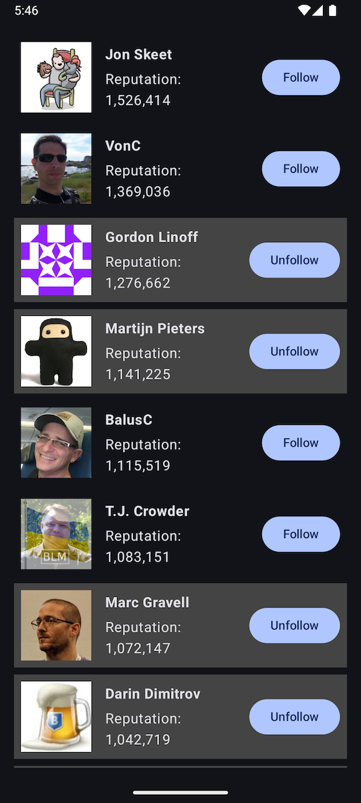

### Author
Amin Afshar

### Submission Date
Monday, 20th/April/2026

### App Image

### Architecture
MVVM

### Deliverables
1. Android App
2. Unit tests

### Dependencies
- App Dependencies:
  - Dagger Hilt
  - RetroFit
  - Moshi
  - Coil
- Test Dependencies:
  - JUnit
  - Robolectric
  - Truth
  - Coroutines Test
  - Turbine

### Notes
1. The app works by fetching the list of users once from StackOverflow during
the initial launch. This is performed on the background.
2. Using a repository and a view-model means the data layer is abstracted from the UI
3. The UI supports loading, empty, error and success states
4. A lazy column is used for efficient list display
5. When a user is followed/unfollowed the result is persisted and a new immutable 
list of users is generated without making an additional network request
6. Using a flow makes delivery of data streamlined
7. Unit tests are added for the repository and followed users
8. Followed users are stored in simple shared preferences for persistence between sessions

